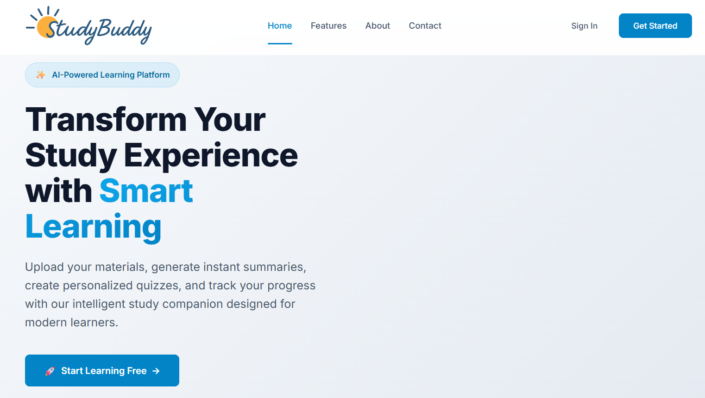
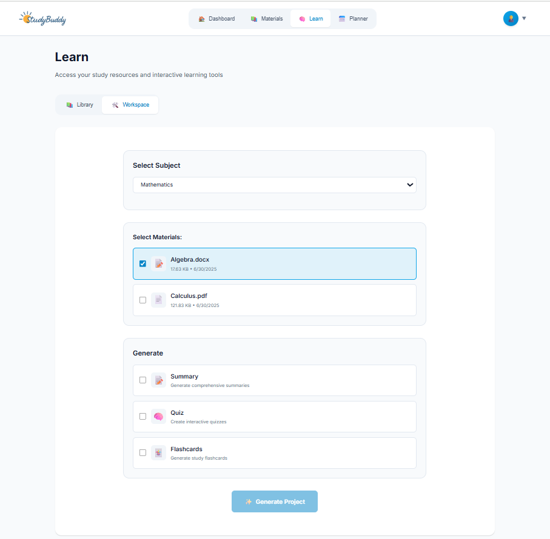

# Studybuddy-AI

StudyBuddy was built to transform how students learn from their existing study materials. Instead of passively reading notes or textbooks, students can upload files like PDFs, DOCX, and PPTX, and instantly generate AI-powered **quizzes**, **flashcards**, and **summaries**. Our vision was to make active learning accessible, personalized, and fast.

---

## 🌟 Inspiration

We noticed how much time is wasted creating practice materials manually. We thought — *what if AI could take over that work?* Inspired by the science of active recall and spaced repetition, we wanted to build a tool that helps students master material more efficiently.

---

## ⚙️ Built

* **Frontend**: Built using vanilla JavaScript, HTML, and CSS, deployed on **Netlify**. We used Bolt.new extensively to iterate on UI design, integrate logic, and rapidly prototype features.
* **Backend**: A Flask app hosted on **Render**, connected to **Supabase** for database, file storage, and user authentication. The backend handles file processing, text extraction, and AI generation.
* **AI Integration**: We used **Google Gemini Pro** through the Vertex AI API to generate learning content on the fly.
* **Supabase**: Managed user files (stored securely), project records, quizzes, and flashcards.
* **Bolt.new**: Helped us build and refine both UI components and functional JavaScript faster — and identify key logic improvements during the build process.

---

## 🚀 Learnings

* How to effectively structure AI prompts for reliable quiz and flashcard generation.
* Best practices for coordinating **Supabase Auth**, file storage, and relational data.
* How to bridge the frontend (Netlify) and backend (Render) for smooth communication.
* Handling file extraction challenges across different document types.

---

## 🔧 Challenges Faced

* **Bolt.new Build Process**: Bolt helped us move fast, but integrating more complex logic (like multi-step quiz flows or conditional UI updates) sometimes required breaking changes or reworking initial prompts. Managing state across Bolt-generated code needed care.
* **AI Response Handling**: Ensuring AI responses (e.g., quiz JSON) were well-formed and ready for parsing was tricky. We refined both our prompt engineering and post-processing logic.
* **File Processing on Render**: While Render made backend deployment easy, handling large files (especially PDFs) and ensuring consistent extraction across deployments took optimization.
* **Frontend / Backend Sync**: Keeping Netlify (frontend) and Render (backend) deployments aligned — especially for API URLs and environment variables — introduced some friction during testing.

---

## Project Screenshots

### Home Page

### Workspace

### Summary

